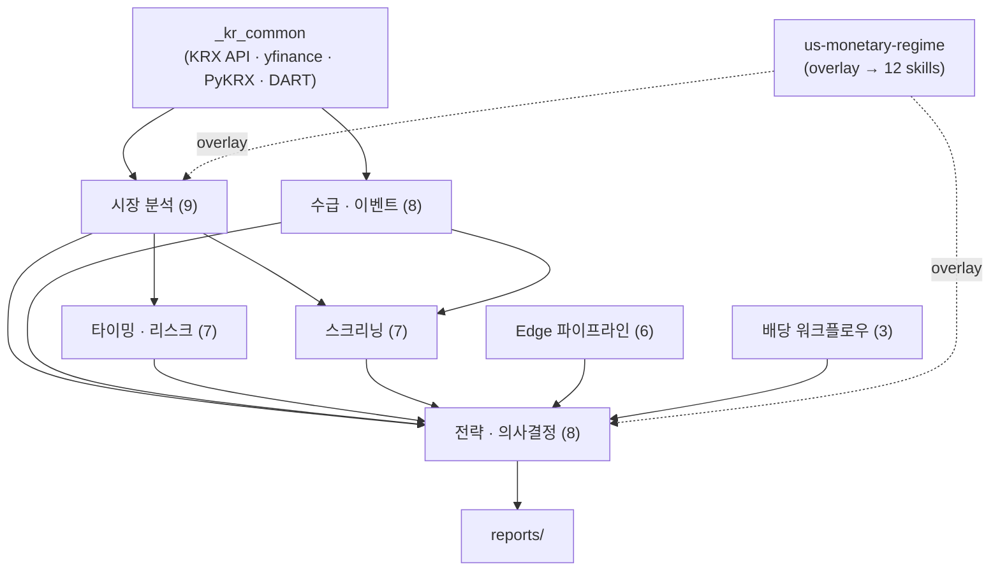
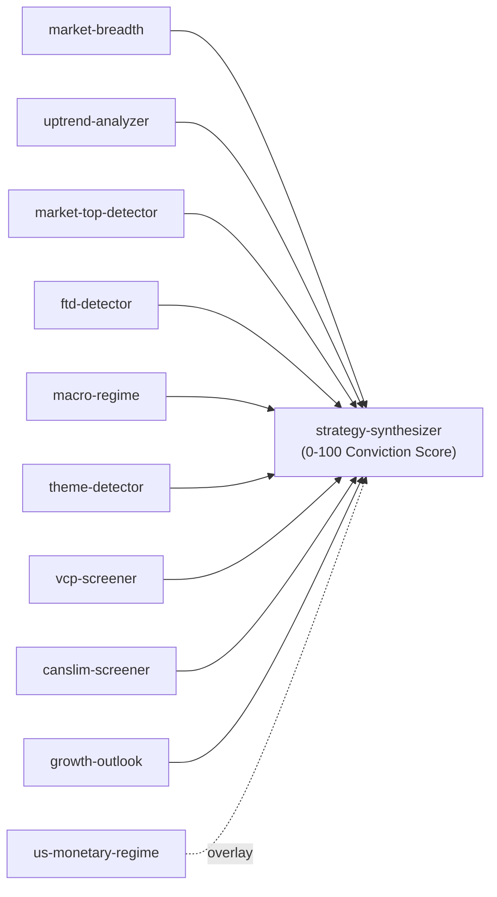

# Korean Stock Trading Skills for Claude Code

한국 주식 시장(KOSPI/KOSDAQ) 분석을 위한 Claude Code 플러그인. 54개 전문 스킬로 시장 분석, 종목 스크리닝, 전략 수립, 포트폴리오 관리까지 워크플로우를 제공합니다.

> **Tier 0**: KRX Open API (인증키 기반, 일 10,000회)
> **Tier 1**: yfinance — 무료, 무제한, OHLCV+재무+밸류에이션 (즉시 가용)
> **Tier 2**: PyKRX + FinanceDataReader + OpenDartReader (KRX 차단 시 불가)
> **Tier 3**: 한국투자증권 Open API 연동 (선택)
> **Tier 4**: WebSearch 폴백 (항상 가용)

---

## Installation

### Method 1: Claude Code Plugin (Recommended)

Claude Code 프롬프트에서 직접 설치:

```
/plugin marketplace add kys061/kr-stock-skills
/plugin install kr-stock-skills
```

설치 후 Python 의존성 설치:

```bash
pip install pykrx finance-datareader opendartreader pandas numpy yfinance
```

### Method 2: Git Clone

```bash
git clone https://github.com/kys061/kr-stock-skills.git
cd kr-stock-skills
./install.sh
```

### Environment Variables

```bash
# DART 공시 데이터 (무료 발급: https://opendart.fss.or.kr/)
export DART_API_KEY='your-dart-api-key'

# 한국투자증권 Open API (Tier 2, 선택)
export KIS_APP_KEY='your-app-key'
export KIS_APP_SECRET='your-app-secret'
export KIS_ACCOUNT='your-account-number'
```

---

## Quick Start

Claude Code에서 `/스킬명` 형태로 호출합니다:

```
/kr-market-environment              ← 시장 환경 종합 진단
/kr-canslim-screener                ← 성장주 CANSLIM 스크리닝
/kr-technical-analyst 삼성전자       ← 삼성전자 기술적 분석
/kr-scenario-analyzer BOK 금리 인하  ← 금리 시나리오 분석
```

---

## Skills Reference (54개)

### Phase 1: 공통 데이터 클라이언트

#### `_kr_common` — KRClient 통합 데이터 클라이언트

모든 KR 스킬이 내부적으로 사용하는 공통 데이터 레이어. 직접 호출이 아닌 다른 스킬을 통해 자동 사용됩니다.

| 기능 | 데이터 소스 | Tier |
|------|------------|------|
| 시세 (OHLCV) | PyKRX, FDR | 1 |
| 밸류에이션 (PER/PBR/EPS) | PyKRX | 1 |
| 투자자별 매매동향 (12분류→3분류) | PyKRX | 1 |
| 공매도 잔고/거래량 | PyKRX | 1 |
| 재무제표 (BS/IS/CF) | DART | 1* |
| 글로벌 지수/환율/원자재 | FDR | 1 |
| FRED 경제지표 | FDR | 1 |
| ETF NAV/괴리율/구성종목 | PyKRX | 1 |
| 국채/회사채 수익률 | PyKRX | 1 |
| 공시/대주주/배당 | DART | 1* |
| 실시간 시세/분봉/호가 | 한투 API | 2 |

\* DART API 키 필요 (무료)

```python
# Python에서 직접 사용 시
from _kr_common.kr_client import KRClient
client = KRClient()
df = client.get_ohlcv('삼성전자', '2025-03-01')
```

---

### Phase 2: 시장 분석 (7개)

#### `/kr-market-environment` — 글로벌+한국 시장 종합 진단

시장 전체 상태를 한눈에 파악하는 종합 리포트를 생성합니다.

```
/kr-market-environment
/kr-market-environment 오늘 시장 환경 분석해줘
/kr-market-environment 미국 금리 인상 후 한국 시장 영향 진단
```

**출력**: 글로벌 지수, 환율, 원자재, 한국 시장 현황, 투자자별 동향, Risk-On/Off 판정

---

#### `/kr-market-breadth` — 시장폭 0-100 점수

KOSPI200/KOSDAQ150 종목의 MA200 돌파 비율로 시장 참여도를 정량화합니다.

```
/kr-market-breadth
/kr-market-breadth 현재 시장폭 점수 알려줘
/kr-market-breadth KOSDAQ150 시장폭 추세 분석
```

**출력**: 0-100 점수, 6개 컴포넌트 (Breadth, Sector Participation, Rotation, Momentum 등)

---

#### `/kr-market-news-analyst` — 뉴스 임팩트 스코어링

최근 10일 시장 뉴스를 수집하고 각 이벤트의 시장 영향도를 1-10으로 평가합니다.

```
/kr-market-news-analyst
/kr-market-news-analyst 이번주 주요 뉴스 분석
/kr-market-news-analyst 반도체 관련 뉴스만 분석해줘
```

---

#### `/kr-sector-analyst` — 업종별 성과 분석

15개 한국 섹터(반도체, 자동차, 조선, 바이오, 원전 등)의 성과를 비교하고 경기순환 위치를 판단합니다.

```
/kr-sector-analyst
/kr-sector-analyst 업종 로테이션 현황 분석
/kr-sector-analyst 반도체 vs 자동차 섹터 비교
```

---

#### `/kr-technical-analyst` — 차트 기술적 분석

주간/일간 차트 이미지 기반으로 추세, 지지/저항, 패턴을 분석합니다.

```
/kr-technical-analyst 삼성전자
/kr-technical-analyst 삼성전자 주간 차트 분석해줘
/kr-technical-analyst 현대차 지지/저항 레벨 분석
```

---

#### `/kr-theme-detector` — 테마/섹터 트렌드 탐지

현재 시장에서 부상 중인 테마와 섹터를 자동 탐지합니다.

```
/kr-theme-detector
/kr-theme-detector 현재 핫한 테마 찾아줘
/kr-theme-detector 2차전지 테마 관련 종목 분석
```

---

#### `/kr-uptrend-analyzer` — 업종별 상승추세 비율

업종별 상승추세 종목 비율을 분석하여 시장 건강도를 측정합니다.

```
/kr-uptrend-analyzer
/kr-uptrend-analyzer 업종별 상승추세 비율 분석
```

**출력**: 0-100 composite score, 5개 컴포넌트 분석

---

### Phase 3: 마켓 타이밍 (5개)

#### `/kr-breadth-chart` — 시장폭 차트 분석

시장폭(MA200 기반) 차트 이미지를 분석하여 참여도 변화 추세를 진단합니다.

```
/kr-breadth-chart
/kr-breadth-chart 시장폭 차트 분석해줘
```

---

#### `/kr-bubble-detector` — 버블 리스크 스코어링

6개 지표(Put/Call, VIX, 신용잔고, 시장폭, IPO, 투기지표)로 버블 위험도를 0-100 점수화합니다.

```
/kr-bubble-detector
/kr-bubble-detector 현재 버블 위험도 확인
/kr-bubble-detector KOSDAQ 시장 과열 진단
```

**출력**: 0-100 버블 스코어, Risk Zone (Green/Yellow/Orange/Red)

---

#### `/kr-ftd-detector` — Follow-Through Day 탐지

KOSPI/KOSDAQ 이중 지수에서 William O'Neil의 FTD 신호를 탐지합니다.

```
/kr-ftd-detector
/kr-ftd-detector KOSPI FTD 신호 확인
/kr-ftd-detector 최근 3개월 FTD 이력 조회
```

**출력**: Rally Attempt → FTD 확인 → Post-FTD 건강도 상태 머신

---

#### `/kr-market-top-detector` — 시장 천장 리스크

7개 컴포넌트로 시장 천장 확률을 0-100으로 평가합니다.

```
/kr-market-top-detector
/kr-market-top-detector 시장 천장 신호 확인
```

**출력**: Distribution Day 카운트, 주도주 열화, 방어 섹터 로테이션 등

---

#### `/kr-macro-regime` — 매크로 레짐 분류

6개 컴포넌트(집중도, 수익률 곡선, 신용, 규모팩터, 채권-주식, 섹터)로 매크로 레짐을 분류합니다.

```
/kr-macro-regime
/kr-macro-regime 현재 매크로 레짐 분석
```

**출력**: RiskOn / Neutral / RiskOff / Crisis 레짐 판정

---

### Phase 4: 종목 스크리닝 (9개)

#### `/kr-stock-screener` — 다조건 필터 스크리닝

KRClient 기반으로 PER, PBR, 배당수익률, 시가총액 등 다양한 조건으로 종목을 필터링합니다.

```
/kr-stock-screener PER 10 이하, 배당수익률 3% 이상 종목 찾아줘
/kr-stock-screener PBR 1 미만 저평가주 KOSPI200에서 찾기
/kr-stock-screener 시가총액 1조 이상, ROE 15% 이상
```

---

#### `/kr-canslim-screener` — CANSLIM 성장주 스크리닝

William O'Neil의 CANSLIM 7개 항목(C/A/N/S/L/I/M)을 한국 시장에 적용한 성장주 스크리닝입니다.

```
/kr-canslim-screener
/kr-canslim-screener KOSPI200 CANSLIM 스크리닝 실행
/kr-canslim-screener KOSDAQ150에서 최고 점수 종목
```

**스코어링**: 각 항목 0-100, 총점 기준 A/B/C/D 등급

---

#### `/kr-vcp-screener` — VCP 패턴 탐지

Mark Minervini의 Stage 2 업트렌드 + VCP(Volatility Contraction Pattern)를 탐지합니다.

```
/kr-vcp-screener
/kr-vcp-screener VCP 패턴 형성 종목 찾기
/kr-vcp-screener KOSPI200에서 Stage 2 종목 스캔
```

**조건**: Stage 2 트렌드 템플릿 + 변동성 수축 + 피봇 근접

---

#### `/kr-value-dividend` — 밸류+배당 가치주 발굴

3-Phase(밸류 필터 → 배당 품질 → 종합 점수) 방식으로 저평가 고배당 종목을 발굴합니다.

```
/kr-value-dividend
/kr-value-dividend 저평가 고배당 종목 찾아줘
/kr-value-dividend PER 15 미만 배당수익률 4% 이상
```

---

#### `/kr-dividend-pullback` — 배당성장주 풀백 타이밍

배당 성장률 12%+ & 수익률 1.5%+ 종목 중 RSI≤40 눌림목을 탐지합니다.

```
/kr-dividend-pullback
/kr-dividend-pullback 배당성장주 눌림목 종목 찾기
/kr-dividend-pullback RSI 35 이하 고배당 성장주
```

---

#### `/kr-pead-screener` — 실적 발표 후 드리프트 분석

실적 발표 후 갭업 종목의 주봉 캔들 패턴(Red Candle Pullback → Breakout)을 분석합니다.

```
/kr-pead-screener
/kr-pead-screener 최근 실적 갭업 종목 분석
/kr-pead-screener 이번 분기 PEAD 패턴 후보
```

---

#### `/kr-pair-trade` — 페어 트레이딩 분석

두 종목 간 상관분석 + 공적분 검정 + Z-Score 기반 페어 트레이딩 기회를 분석합니다.

```
/kr-pair-trade 현대차 기아 페어 분석
/kr-pair-trade 삼성전자 SK하이닉스 페어 분석
/kr-pair-trade 포스코홀딩스 포스코퓨처엠 스프레드 분석
```

---

#### `/kr-ichimoku-filter` — 일목균형표 전환선 필터

일봉 기준 종가가 전환선(9일) 위에서 마감했는지 확인합니다. 스크리너 스킬의 추가 확인 지표로 활용됩니다.

```
/kr-ichimoku-filter 삼성전자
/kr-ichimoku-filter 005930 일목균형표 전환선 확인
```

**판정**: Close > 전환선 = PASS (단기 상승 모멘텀 유지)

---

#### `/kr-stochastic-filter` — Stochastic Slow 필터

Stochastic Slow (18,10,10) 기반 모멘텀 확인 필터. Slow %K >= Slow %D 조건을 판정합니다.

```
/kr-stochastic-filter 삼성전자
/kr-stochastic-filter 005930 스토캐스틱 확인
```

**판정**: Slow %K >= Slow %D = PASS | 과매수/중립/과매도 영역 표시

---

### Phase 5: 캘린더 & 실적 분석 (4개)

#### `/kr-economic-calendar` — 경제지표 발표 일정

ECOS 기반 12개 주요 경제지표(GDP, CPI, 기준금리, 무역수지 등) 발표 일정을 제공합니다.

```
/kr-economic-calendar
/kr-economic-calendar 이번달 주요 경제지표 일정
/kr-economic-calendar 다음주 BOK 금리 결정 일정
```

---

#### `/kr-earnings-calendar` — 실적 발표 일정

DART 기반 잠정/확정 실적 발표 일정과 컨센서스를 제공합니다.

```
/kr-earnings-calendar
/kr-earnings-calendar 이번주 실적 발표 기업
/kr-earnings-calendar 삼성전자 실적 발표일 언제야
```

---

#### `/kr-earnings-trade` — 실적 후 5팩터 분석

실적 발표 후 5개 팩터(Gap Size, Pre-Trend, Volume, MA200, MA50)로 0-100 스코어링합니다.

```
/kr-earnings-trade 삼성전자 실적 후 분석
/kr-earnings-trade LG에너지솔루션 어닝 서프라이즈 분석
```

**등급**: A(80+) / B(60-79) / C(40-59) / D(<40)

---

#### `/kr-institutional-flow` — 투자자별 수급 추적

외국인/기관/개인 투자자별 매매동향을 4개 컴포넌트로 추적합니다.

```
/kr-institutional-flow 삼성전자
/kr-institutional-flow 삼성전자 외국인 수급 동향
/kr-institutional-flow SK하이닉스 기관 매수 추이
```

---

### Phase 6: 전략 & 리스크 관리 (9개)

#### Edge 파이프라인 (4개)

시장 관찰 → 가설 → 전략 → 후보 탐지의 체계적 엣지 발굴 파이프라인입니다.

**`/kr-edge-hint`** — 수급 데이터 기반 엣지 힌트 추출

```
/kr-edge-hint
/kr-edge-hint 오늘 시장 관찰로 엣지 힌트 생성
```

**`/kr-edge-concept`** — 8개 가설 유형 기반 엣지 컨셉 합성

```
/kr-edge-concept
/kr-edge-concept 힌트들을 엣지 컨셉으로 합성해줘
```

**`/kr-edge-strategy`** — 엣지 컨셉 → 전략 드래프트 변환

```
/kr-edge-strategy
/kr-edge-strategy breakout 컨셉 전략 드래프트 생성
```

**`/kr-edge-candidate`** — 후보 자동 탐지 & 파이프라인 내보내기

```
/kr-edge-candidate
/kr-edge-candidate KOSPI200 후보 탐지
```

---

#### 백테스트 & 피봇 (2개)

**`/kr-backtest-expert`** — 5차원 스코어링 백테스트 평가

백테스트 결과를 5차원(수익성, 안정성, 리스크, 거래특성, 강건성) 100점 만점으로 평가합니다.

```
/kr-backtest-expert
/kr-backtest-expert 이 전략 백테스트 결과 평가해줘
/kr-backtest-expert CAGR 15% MDD -12% 전략 평가
```

**판정**: DEPLOY(80+) / REFINE(60-79) / INCUBATE(40-59) / ABANDON(<40)

**`/kr-strategy-pivot`** — 반복 최적화 정체 감지 & 피봇 제안

파라미터 최적화가 정체되었을 때 구조적으로 다른 전략 방향을 제안합니다.

```
/kr-strategy-pivot
/kr-strategy-pivot 반복 최적화 정체 진단
```

---

#### 옵션 & 포트폴리오 (3개)

**`/kr-options-advisor`** — KOSPI200 옵션 전략 시뮬레이터

Black-Scholes 가격결정, 그릭스, 18개 전략 시뮬레이션을 제공합니다.

```
/kr-options-advisor KOSPI200 350 기준 bull call spread 시뮬레이션
/kr-options-advisor 350 콜 355행사가 30일 가격
/kr-options-advisor iron condor 340-345-355-360 분석
```

**한국 특화**: KOSPI200 승수 250,000원, VKOSPI, BOK 금리 3.5%

**`/kr-portfolio-manager`** — 포트폴리오 분석 & 리밸런싱

한국 세제(배당세 15.4%, ISA, 금종과세)를 반영한 포트폴리오 분석과 리밸런싱을 제공합니다.

```
/kr-portfolio-manager
/kr-portfolio-manager 내 포트폴리오 분석해줘
/kr-portfolio-manager 삼성전자 30% SK하이닉스 20% 리밸런싱
```

**`/kr-scenario-analyzer`** — 18개월 3-시나리오 분석

뉴스/이벤트를 기반으로 Base/Bull/Bear 3가지 시나리오의 18개월 전개를 분석합니다.

```
/kr-scenario-analyzer BOK 기준금리 0.25%p 인하 시나리오
/kr-scenario-analyzer 미중 무역전쟁 격화 시나리오
/kr-scenario-analyzer 반도체 수출 30% 증가 시나리오
```

---

### Phase 7: 배당 & 세제 최적화 (3개)

#### `/kr-dividend-sop` — 5단계 배당 투자 SOP

스크리닝 → 진입 → 보유 → 수령 → EXIT까지 배당 투자 전체 프로세스를 제공합니다.

```
/kr-dividend-sop
/kr-dividend-sop 배당 투자 전체 프로세스 실행
/kr-dividend-sop 고배당 포트폴리오 구축 가이드
```

---

#### `/kr-dividend-monitor` — 배당 안전성 모니터링

T1-T5 트리거(감배/정관변경/실적악화/지배구조/업황) 기반으로 배당 안전성을 모니터링합니다.

```
/kr-dividend-monitor 삼성전자
/kr-dividend-monitor 삼성전자 배당 안전성 체크
/kr-dividend-monitor 내 배당 포트폴리오 전체 진단
```

**상태**: OK / WARN / REVIEW

---

#### `/kr-dividend-tax` — 배당 세제 최적화

한국 배당세 완전 분석과 계좌 배치(ISA/연금저축/IRP) 최적화를 제공합니다.

```
/kr-dividend-tax
/kr-dividend-tax 배당 절세 전략 최적화
/kr-dividend-tax ISA vs 연금저축 어디에 배치할지
/kr-dividend-tax 금융소득종합과세 대응 전략
```

**주요 세율**: 배당세 15.4%, ISA 비과세 200만원, 금종과세 2,000만원 초과 시

---

### Phase 8: 메타 & 유틸리티 (4개)

#### `/kr-stock-analysis` — 종합 주식 분석

펀더멘털(재무/밸류에이션) + 기술적(추세/패턴) + 수급(투자자별) + 밸류에이션 + 성장성 5-컴포넌트 종합 분석을 한 번에 제공합니다. US 통화정책 오버레이 적용 가능.

```
/kr-stock-analysis 삼성전자
/kr-stock-analysis 삼성전자 종합 분석
/kr-stock-analysis SK하이닉스 투자 적합성 진단
```

---

#### `/kr-strategy-synthesizer` — 9-컴포넌트 확신도 통합

9개 업스트림 스킬 결과(Market Breadth, Uptrend, Market Top, Macro, FTD, VCP, CANSLIM, Growth Outlook, US Monetary Regime)를 통합하여 0-100 확신도 점수를 산출합니다.

```
/kr-strategy-synthesizer
/kr-strategy-synthesizer 현재 시장 확신도 분석
/kr-strategy-synthesizer 공격적 투자 가능한 상황인지 판단
```

---

#### `/kr-skill-reviewer` — 스킬 품질 검증

Auto 5체크(구조/스크립트/테스트/실행안전성) + LLM 딥리뷰로 스킬 품질을 자동 검증합니다.

```
/kr-skill-reviewer kr-canslim-screener
/kr-skill-reviewer kr-options-advisor 리뷰
```

---

#### `/kr-weekly-strategy` — 주간 전략 리포트

4개 시장 상태 + 15 섹터 분석 + 8개 체크리스트로 주간 전략 리포트를 생성합니다.

```
/kr-weekly-strategy
/kr-weekly-strategy 이번주 전략 리포트 생성
```

---

### Phase 9: 한국 시장 전용 (5개)

해외 시장에 없는 한국 고유 데이터(투자자별 수급, 공매도 잔고, 신용잔고, 프로그램 매매, DART 공시)를 분석하는 전용 스킬입니다.

#### `/kr-supply-demand-analyzer` — 수급 종합 분석

시장/섹터 수급을 7단계 시그널(Strong Buy ~ Strong Sell)로 분류하고, 15 섹터별 HHI(허핀달 지수)로 집중도를 분석합니다.

```
/kr-supply-demand-analyzer
/kr-supply-demand-analyzer KOSPI 외국인 수급 분석
/kr-supply-demand-analyzer 반도체 섹터 수급 집중도
```

---

#### `/kr-short-sale-tracker` — 공매도 잔고 추적

공매도 잔고 추이와 숏커버 시그널을 탐지합니다.

```
/kr-short-sale-tracker 삼성전자
/kr-short-sale-tracker 삼성전자 공매도 분석
/kr-short-sale-tracker 공매도 잔고 급증 종목 찾기
```

**시그널**: SHORT_SQUEEZE / SHORT_COVERING / SHORT_BUILDUP

---

#### `/kr-credit-monitor` — 신용잔고 & 반대매매 리스크

신용잔고 비율과 반대매매 리스크를 모니터링합니다.

```
/kr-credit-monitor
/kr-credit-monitor 시장 전체 신용 리스크 진단
/kr-credit-monitor 삼성전자 신용잔고 비율 확인
```

**주요 지표**: 신용잔고 비율, 담보유지비율 140%, 반대매매 위험 구간

---

#### `/kr-program-trade-analyzer` — 프로그램 매매 분석

차익/비차익 거래, KOSPI200 베이시스, 만기일 효과를 종합 분석합니다.

```
/kr-program-trade-analyzer
/kr-program-trade-analyzer 프로그램 매매 분석
/kr-program-trade-analyzer 이번주 선물 만기일 효과 예측
```

---

#### `/kr-dart-disclosure-monitor` — DART 공시 모니터링

10개 유형(실적/배당/자본/M&A/지배구조/지분/법적/IPO/규제/기타)으로 공시를 자동 분류하고 이벤트 영향도를 평가합니다.

```
/kr-dart-disclosure-monitor 삼성전자
/kr-dart-disclosure-monitor 삼성전자 최근 공시 분석
/kr-dart-disclosure-monitor 오늘 주요 공시 모니터링
```

**출력**: 공시 유형 분류 + 이벤트 영향도 1-10 스코어 + 지분 변동 추적

---

### Patch: 성장성 전망 분석

#### `/kr-growth-outlook` — 6-컴포넌트 성장성 종합 분석

TAM/SAM, 경쟁 해자, 파이프라인, 실적 전망, 정책 수혜, 경영진 6축으로 종목/섹터 성장성을 3개 시간축(단기/중기/장기)으로 정량화합니다.

```
/kr-growth-outlook 삼성전자
/kr-growth-outlook 삼성전자 반도체 성장성 전망
/kr-growth-outlook 2차전지 섹터 중장기 성장 분석
```

**출력**: 종합 성장 점수 (0-100), 6개 컴포넌트 점수, 3-시간축 전망, 성장 등급 (A/B/C/D/F)

**연동**: `kr-stock-analysis`에 5번째 컴포넌트(성장성 0.13), `kr-strategy-synthesizer`에 8번째 컴포넌트(growth_outlook 0.10) 통합

---

### Patch: US 통화정책 분석

#### `/us-monetary-regime` — US 통화정책 레짐 종합 분석

Fed 기조, 금리 트렌드, 유동성 3축으로 US 통화정책 레짐을 판정하고, B방식 오버레이로 한국 14섹터에 미치는 영향을 정량화합니다.

```
/us-monetary-regime
/us-monetary-regime FOMC dovish + 금리 인하 사이클 분석
/us-monetary-regime 현재 Fed 기조가 한국 반도체 섹터에 미치는 영향
```

**출력**: US 레짐 (tightening/hold/easing), overlay +-15pts, 14섹터별 영향도, 한국 전이 5채널 분석

**하위 모듈**:
| 모듈 | 출력 | 설명 |
|------|------|------|
| `fed_stance_analyzer` | -100~+100 | FOMC 톤 + 점도표 + QT/QE + 위원 발언 |
| `rate_trend_classifier` | 0~100 | 금리 5단계 (aggressive_hike ~ aggressive_cut) |
| `liquidity_tracker` | 0~100 | Fed B/S + M2 + DXY + RRP |
| `kr_transmission_scorer` | 5채널 + overlay | 금리차/환율/위험선호/섹터회전/BOK후행 |
| `regime_synthesizer` | 종합 | stance*0.35 + rate*0.30 + liquidity*0.35 |

**B방식 오버레이**: 기존 종합 스코어 불변, `(regime_score - 50) * 0.30 * sector_sensitivity` 가산

---

### Patch: 매일 아침 시장 체크

#### `/daily-market-check` — 글로벌 매크로 6개 지표 체크

매일 아침 VIX, CNN Fear & Greed, KOSPI, USD/KRW, S&P 500, EWY 6개 지표를 조회하여 시장 상태를 빠르게 판정합니다.

```
/daily-market-check
/daily-market-check 오늘 시장 상태 체크해줘
```

**출력**: 6개 지표 수치 테이블, 상태 판정 (정상/주의/경고/극공포), 종합 시장 판단 (정상/주의/경고/위험)

**스크립트**: `python3 skills/daily-market-check/scripts/market_check.py` (yfinance 기반 자동 수집)

---

### Patch: 폭락 반등 시그널 체크

#### `/kr-rebound-signal` — 급락 시 14개 반등 시그널 체크

한국 주식시장 급락 발생 시 14개 반등 시그널(VIX/CNN F&G/Put-Call/EWY/S&P선물/인사이더/외국인/공매도/신용/HY스프레드/환율/RSI/정부대책/뉴스톤)을 체계적으로 점검합니다.

```
/kr-rebound-signal
/kr-rebound-signal 현재 반등 시그널 체크해줘
/kr-rebound-signal KOSPI 급락 후 바닥 시그널 확인
```

**출력**: 14개 시그널 YES/NO 테이블, 종합 판단 (관망/분할매수/적극매수/역사적반등)

**스크립트**: `python3 skills/kr-rebound-signal/scripts/rebound_check.py` (yfinance 기반 5개 자동 + 9개 WebSearch)

---

### Patch: 역사적 위기 비교 패턴

#### `/kr-crisis-compare` — 역사적 위기 비교 분석

현재 시장 상황을 5개 역사적 위기(금융위기/코로나/금리인상/관세쇼크/이란위기)와 5차원 유사도 비교하여 가장 유사한 패턴의 회복 시나리오를 제시합니다.

```
/kr-crisis-compare
/kr-crisis-compare 현재 시장 상황 역사적 비교 분석
/kr-crisis-compare --type geopolitical  위기 유형 수동 지정
```

**출력**: 유사도 순위 테이블, 회복 패턴(1주/1개월/3개월/6개월), 낙관/기본/보수 3-시나리오

**스크립트**: `python3 skills/kr-crisis-compare/scripts/crisis_compare.py` (yfinance 기반 자동 수집 + 5차원 유사도 엔진)

---

### Patch: 특정 지표 심층 분석

#### `/kr-indicator-deep-dive` — 시장 지표 심층 해부

주요 시장 지표(VIX, CNN F&G, EWY, KOSPI RSI, USD/KRW, HY OAS, Put/Call, VKOSPI)를 개별 5가지 항목(현재 수치, 역대 극단값, 역사적 위치, 이후 수익률, 한 문장 요약)으로 심층 분석합니다.

```
/kr-indicator-deep-dive
/kr-indicator-deep-dive VIX 심층 분석해줘
/kr-indicator-deep-dive VIX CNN공포탐욕 KOSPI RSI 분석
/kr-indicator-deep-dive 전체 8개 지표 심층 분석
```

**출력**: 지표별 5항목 심층 분석 + 종합 대시보드 (복수 지표 시) + 초보자 한 문장 요약

### Patch: 폭락 후 회복 추적

#### `/kr-recovery-tracker` — 시장 폭락 후 회복 모니터링

7개 핵심 지표(KOSPI, VIX, CNN F&G, USD/KRW, EWY, 외국인 수급, 뉴스 톤)로 급락 이후 회복 진행 상황을 추적하고 5단계 회복 모델로 현재 위치를 판단합니다.

```
/kr-recovery-tracker
/kr-recovery-tracker 회복 추적 업데이트
/kr-recovery-tracker 위기전 KOSPI 6244 바닥 5094
```

**출력**: 회복 대시보드 + KOSPI 회복률 + 어제 대비 변화 + 뉴스 헤드라인 3개 + 5단계 회복 판단

### Patch: 뉴스 톤 분석

#### `/kr-news-tone-analyzer` — 뉴스 센티먼트 전환 판단

최근 24시간 한국 증시 뉴스 헤드라인을 수집하여 공포/중립/안정 톤을 분류하고, 톤 비율 집계 + 정부 발언 추적 + 시장 센티먼트 전환 여부를 판단합니다.

```
/kr-news-tone-analyzer
/kr-news-tone-analyzer 오늘 뉴스 톤 분석
/kr-news-tone-analyzer 이란 사태 뉴스 톤
```

**출력**: 헤드라인 테이블 + 톤 비율 (공포/중립/안정 %) + 정부 발언 + 전환 판단 한 줄 요약

---

## Skill Relationship Map (스킬 연관 관계도)

54개 스킬은 **7개 클러스터 + 1개 크로스커팅 모듈**로 구성되며, 데이터 → 분석 → 선별 → 의사결정 파이프라인을 형성합니다.

### 전체 아키텍처



### 클러스터별 구성 및 연관 관계

#### ① 시장 분석 (9개) — 시장 전체 상태 진단

| 스킬 | 역할 | 다운스트림 |
|------|------|-----------|
| `market-environment` | 글로벌+한국 종합 진단 | → 전략 판단 컨텍스트 |
| `market-breadth` | MA200 시장폭 0-100 | → top-detector, ftd, breadth-chart, **synthesizer** |
| `uptrend-analyzer` | 업종별 상승추세 비율 | → breadth-chart, **synthesizer** |
| `macro-regime` | 크로스에셋 레짐 분류 | → top-detector, canslim(M), **synthesizer** |
| `sector-analyst` | 15섹터 성과·로테이션 | → growth-outlook, scenario-analyzer |
| `theme-detector` | 테마 트렌드 탐지 | → **synthesizer** |
| `technical-analyst` | 차트 기술적 분석 | → stock-analysis |
| `market-news-analyst` | 뉴스 임팩트 1-10 | → 시장 컨텍스트 |
| `daily-market-check` | 6지표 매일 체크 | → 데일리 판단 |

#### ② 수급 · 이벤트 (8개) — 종목/시장 레벨 데이터

| 스킬 | 분석 레벨 | 주요 연관 |
|------|:--------:|----------|
| `institutional-flow` | 종목 | → stock-analysis (수급 컴포넌트) |
| `supply-demand-analyzer` | 시장/섹터 | → 15섹터 HHI 집중도 |
| `short-sale-tracker` | 종목 | → 숏커버/숏스퀴즈 시그널 |
| `program-trade-analyzer` | 시장 | 한국 고유 (선물 베이시스, 만기일) |
| `economic-calendar` | 이벤트 | → 매크로 이벤트 타이밍 |
| `earnings-calendar` | 이벤트 | → **earnings-trade**, **pead-screener** |
| `earnings-trade` | 종목 | ← earnings-calendar → 5팩터 스코어 |
| `dart-disclosure-monitor` | 종목 | → 공시 영향도 1-10, dividend-monitor |

#### ③ 타이밍 · 리스크 (7개) — 진입/퇴출 시점 판단

| 스킬 | 업스트림 | 다운스트림 |
|------|---------|-----------|
| `market-top-detector` | ← breadth, macro-regime | → **synthesizer** |
| `ftd-detector` | ← breadth | → **synthesizer** |
| `bubble-detector` | (독립) | → 리스크 경고 |
| `breadth-chart` | ← breadth, uptrend | → 시각적 진단 |
| `credit-monitor` | (독립) | → 반대매매 리스크 경고 |
| `rebound-signal` | ← credit-monitor, daily-check | → 급락 시 14시그널 바닥 판단 |
| `crisis-compare` | ← rebound-signal, daily-check | → 역사적 패턴 기반 회복 시나리오 |

> `ftd-detector`(바닥 탐지) ↔ `market-top-detector`(천장 탐지)는 **공격/방어 페어**로 함께 사용

#### ④ 스크리닝 (7개) — 조건별 종목 선별

| 스킬 | 방법론 | 주요 연관 |
|------|--------|----------|
| `stock-screener` | 다조건 필터 | (독립 범용 도구) |
| `canslim-screener` | CANSLIM 7항목 | M항목 ← breadth, macro-regime, top-detector → **synthesizer** |
| `vcp-screener` | Minervini VCP | → **synthesizer** |
| `value-dividend` | 밸류+배당 3-Phase | → dividend-sop |
| `dividend-pullback` | RSI 눌림목 | → dividend-sop |
| `pead-screener` | 실적 드리프트 | ← earnings-calendar |
| `pair-trade` | 공적분+Z-Score | (독립) |

#### ⑤ Edge 파이프라인 (6개) — 체계적 엣지 발굴

순차적 파이프라인으로 시장 관찰에서 실행 가능한 전략까지 연결합니다:

```
edge-hint ──→ edge-concept ──→ edge-strategy ──→ edge-candidate
(시장 관찰)     (가설 합성)       (전략 드래프트)     (후보 탐지)
                                      │
                                      ▼
                           backtest-expert ──→ strategy-pivot
                           (5차원 평가)          (정체 시 피봇)
```

#### ⑥ 배당 워크플로우 (3개) — 배당 투자 전 과정

스크리닝(④) → 배당 SOP → 전략(⑦)으로 이어지는 크로스 클러스터 워크플로우:

```
[스크리닝 ④]                [배당 ⑥]                    [전략 ⑦]
value-dividend ──┐
                 ├──→ dividend-sop ──→ dividend-monitor
dividend-pullback┘    (5단계 SOP)      (T1-T5 안전성)
                           │
                           ▼
                      dividend-tax ──→ portfolio-manager
                      (세제 최적화)      (세후 수익률)
```

#### ⑦ 전략 · 의사결정 (8개) — 최종 종합 판단

| 스킬 | 통합 범위 | 업스트림 |
|------|----------|---------|
| `strategy-synthesizer` | 9개 스킬 통합 → 0-100 확신도 | breadth, uptrend, top-detector, ftd, macro-regime, theme, vcp, canslim, growth-outlook |
| `stock-analysis` | 5-컴포넌트 → 0-100 종합 | 펀더멘털(30%) + 기술적(22%) + 수급(22%) + 밸류(13%) + 성장(13%) |
| `weekly-strategy` | 시장상태 + 15섹터 + 체크리스트 | 다수 업스트림 |
| `portfolio-manager` | 세후 수익률, 리밸런싱 | dividend-tax, stock-analysis |
| `scenario-analyzer` | 3-시나리오 18개월 전개 | ← sector-analyst |
| `growth-outlook` | 6-컴포넌트 성장 전망 | → stock-analysis, **synthesizer** |
| `options-advisor` | KOSPI200 옵션 전략 | (독립) |
| `skill-reviewer` | 스킬 품질 검증 | (메타 유틸리티) |

#### ⑧ 크로스커팅: US 통화정책 오버레이

`us-monetary-regime`이 산출한 레짐 스코어가 **12개 스킬**의 최종 점수에 B방식 오버레이로 가산됩니다:

```
overlay = (regime_score - 50) × 0.30 × sector_sensitivity
```

| 적용 유형 | 스킬 |
|:---------:|------|
| 스코어링 | stock-analysis, sector-analyst, growth-outlook, portfolio-manager, strategy-synthesizer |
| 컨텍스트 | macro-regime, market-environment, market-breadth, scenario-analyzer, earnings-trade, economic-calendar, weekly-strategy |

### strategy-synthesizer 통합 구조



### 핵심 허브 스킬 (연결 수 Top 5)

| 순위 | 스킬 | 역할 | 연결 수 |
|:----:|------|------|:------:|
| 1 | `strategy-synthesizer` | 9개 업스트림 통합 → 확신도 | **10** |
| 2 | `market-breadth` | 시장폭 → 4개 스킬에 공급 | **5** |
| 3 | `stock-analysis` | 5-컴포넌트 종합 분석 | **5** |
| 4 | `macro-regime` | 레짐 분류 → 3개 스킬에 공급 | **4** |
| 5 | `us-monetary-regime` | 12개 스킬에 오버레이 | **12** |

### 독립 실행 가능 스킬 (업스트림 의존 없음)

다른 스킬의 선행 실행 없이 단독으로 사용할 수 있는 스킬:

`stock-screener` · `pair-trade` · `options-advisor` · `bubble-detector` · `credit-monitor` · `short-sale-tracker` · `institutional-flow` · `technical-analyst` · `market-news-analyst` · `daily-market-check` · `dart-disclosure-monitor` · `skill-reviewer`

---

## Workflows

### 1. 매일 아침 시장 체크

```
/kr-market-environment          → 글로벌+한국 시장 종합 진단
/kr-market-breadth              → 시장폭 점수 확인 (0-100)
/kr-macro-regime                → 매크로 레짐 (RiskOn/Neutral/RiskOff)
/kr-bubble-detector             → 버블 리스크 점수
/kr-market-top-detector         → 천장 신호 확인
```

### 2. 종목 발굴

```
/kr-canslim-screener            → 성장주 CANSLIM 스크리닝
/kr-vcp-screener                → VCP 패턴 종목 탐지
/kr-technical-analyst [종목]     → 차트 분석으로 진입 타이밍
/kr-institutional-flow [종목]    → 외국인/기관 수급 확인
/kr-supply-demand-analyzer      → 수급 종합 분석
```

### 3. 배당 투자

```
/kr-value-dividend              → 저평가 고배당 종목 발굴
/kr-dividend-pullback           → RSI 눌림목 타이밍
/kr-dividend-sop                → 5단계 SOP (스크리닝→진입→보유→수령→EXIT)
/kr-dividend-monitor            → T1-T5 배당 안전성 모니터링
/kr-dividend-tax                → ISA/연금저축/IRP 계좌 배치 최적화
/kr-portfolio-manager           → 세후 수익률 포트폴리오 분석
```

### 4. Edge 파이프라인

```
/kr-edge-hint                   → 시장 관찰 → 엣지 힌트 추출
/kr-edge-concept                → 힌트 → 엣지 컨셉 합성
/kr-edge-strategy               → 컨셉 → 전략 드래프트 생성
/kr-edge-candidate              → 후보 탐지 & 내보내기
/kr-backtest-expert             → 백테스트 결과 5차원 평가
/kr-strategy-pivot              → 정체 시 구조적 피봇 제안
```

### 5. 실적 시즌

```
/kr-earnings-calendar           → 이번주/이번달 실적 발표 일정
/kr-earnings-trade              → 실적 발표 후 5팩터 스코어링
/kr-pead-screener               → PEAD 패턴 (실적 후 드리프트)
/kr-dart-disclosure-monitor     → 실적 공시 자동 분류 & 영향도
```

### 6. 옵션 전략

```
/kr-options-advisor             → KOSPI200 옵션 가격결정 & 그릭스
/kr-scenario-analyzer           → 이벤트 시나리오 분석으로 방향성 판단
```

### 7. 수급 & 프로그램 매매

```
/kr-supply-demand-analyzer      → 시장/섹터 수급 종합 (14섹터 HHI)
/kr-short-sale-tracker          → 공매도 잔고 추적 + 숏커버 시그널
/kr-credit-monitor              → 신용잔고 + 반대매매 리스크
/kr-program-trade-analyzer      → 차익/비차익 + 베이시스 + 만기일 효과
```

### 8. 주간 종합 전략

```
/kr-stock-analysis [종목]       → 펀더멘털+기술적+수급 종합 분석
/kr-strategy-synthesizer        → 7-컴포넌트 확신도 통합 판단
/kr-weekly-strategy             → 주간 전략 리포트 + 8개 체크리스트
```

---

## Korean Market Constants

| 항목 | 값 |
|------|-----|
| **수수료** | 0.015% |
| **거래세** | 0.23% (KOSPI), 0.23% (KOSDAQ) |
| **슬리피지** | 0.1% |
| **배당세** | 15.4% (소득세 14% + 지방세 1.4%) |
| **ISA 비과세** | 200만원 (서민형 400만원) |
| **대주주 양도세** | 10억원 이상 보유 시 22% |
| **금융소득종합과세** | 연 2,000만원 초과 시 종합소득 합산 |
| **가격제한폭** | ±30% |
| **KOSPI200 옵션 승수** | 250,000원 |
| **담보유지비율** | 140% |
| **14 한국 섹터** | 반도체, 자동차, 조선, 바이오, 금융, 2차전지, 철강, 화학, 건설, 유통, 통신, 미디어, 음식료, IT |

---

## Project Structure

```
kr-stock-skills/
├── .claude-plugin/
│   ├── plugin.json              # Claude Code 플러그인 매니페스트
│   └── marketplace.json         # 마켓플레이스 등록 정보
├── README.md
├── install.sh                   # 설치 스크립트
├── skills/
│   ├── _kr_common/              # Phase 1: 공통 데이터 클라이언트
│   ├── kr-market-environment/   # Phase 2: 시장 분석 (7개)
│   ├── kr-market-breadth/
│   ├── kr-market-news-analyst/
│   ├── kr-sector-analyst/
│   ├── kr-technical-analyst/
│   ├── kr-theme-detector/
│   ├── kr-uptrend-analyzer/
│   ├── kr-breadth-chart/        # Phase 3: 마켓 타이밍 (5개)
│   ├── kr-bubble-detector/
│   ├── kr-ftd-detector/
│   ├── kr-market-top-detector/
│   ├── kr-macro-regime/
│   ├── kr-ichimoku-filter/       # Phase 4: 종목 스크리닝 (9개)
│   ├── kr-stochastic-filter/
│   ├── kr-stock-screener/
│   ├── kr-canslim-screener/
│   ├── kr-vcp-screener/
│   ├── kr-value-dividend/
│   ├── kr-dividend-pullback/
│   ├── kr-pead-screener/
│   ├── kr-pair-trade/
│   ├── kr-economic-calendar/    # Phase 5: 캘린더 & 실적 (4개)
│   ├── kr-earnings-calendar/
│   ├── kr-earnings-trade/
│   ├── kr-institutional-flow/
│   ├── kr-edge-hint/            # Phase 6: 전략 & 리스크 (9개)
│   ├── kr-edge-concept/
│   ├── kr-edge-strategy/
│   ├── kr-edge-candidate/
│   ├── kr-backtest-expert/
│   ├── kr-strategy-pivot/
│   ├── kr-options-advisor/
│   ├── kr-portfolio-manager/
│   ├── kr-scenario-analyzer/
│   ├── kr-dividend-sop/         # Phase 7: 배당 & 세제 (3개)
│   ├── kr-dividend-monitor/
│   ├── kr-dividend-tax/
│   ├── kr-stock-analysis/       # Phase 8: 메타 & 유틸리티 (4개)
│   ├── kr-strategy-synthesizer/
│   ├── kr-skill-reviewer/
│   ├── kr-weekly-strategy/
│   ├── kr-supply-demand-analyzer/ # Phase 9: 한국 시장 전용 (5개)
│   ├── kr-short-sale-tracker/
│   ├── kr-credit-monitor/
│   ├── kr-program-trade-analyzer/
│   └── kr-dart-disclosure-monitor/
│   ├── kr-growth-outlook/       # Patch: 6-컴포넌트 성장성 전망
│   ├── us-monetary-regime/      # Patch: US 통화정책 레짐 (독립 스킬)
│   ├── kr-rebound-signal/      # Patch: 급락 시 14개 반등 시그널 체크
│   ├── kr-crisis-compare/      # Patch: 역사적 위기 비교 패턴
│   ├── kr-indicator-deep-dive/ # Patch: 특정 지표 심층 분석
│   ├── kr-recovery-tracker/   # Patch: 폭락 후 회복 추적
│   └── kr-news-tone-analyzer/ # Patch: 뉴스 톤 분석
└── docs/                        # PDCA 설계 문서
    ├── 01-plan/
    ├── 02-design/
    ├── 03-analysis/
    └── 04-report/
```

---

## Development

| Phase | 내용 | 스킬 수 | 테스트 | Match Rate | 상태 |
|:-----:|------|:-------:|:------:|:----------:|:----:|
| 1 | 공통 모듈 (`_kr_common`) | 1 | 25 | 91% | Done |
| 2 | 시장 분석 스킬 | 7 | 101 | 92% | Done |
| 3 | 마켓 타이밍 스킬 | 5 | 202 | 97% | Done |
| 4 | 종목 스크리닝 스킬 | 9 | 283 | 97% | Done |
| 5 | 캘린더 & 실적 분석 스킬 | 4 | 139 | 97% | Done |
| 6 | 전략 & 리스크 관리 스킬 | 9 | 330 | 97% | Done |
| 7 | 배당 & 세제 최적화 스킬 | 3 | 217 | 97% | Done |
| 8 | 메타 & 유틸리티 스킬 | 4 | 188 | 97% | Done |
| 9 | 한국 시장 전용 스킬 | 5 | 340 | 97% | Done |
| Patch | 성장성 전망 (kr-growth-outlook) | 1 | 72 | 97% | Done |
| Patch | US 통화정책 (us-monetary-regime) | 1 | 106 | 97% | Done |
| Patch | 반등 시그널 (kr-rebound-signal) | 1 | 59 | - | Done |
| Patch | 위기 비교 (kr-crisis-compare) | 1 | 76 | - | Done |
| Patch | 지표 심층 (kr-indicator-deep-dive) | 1 | 33 | - | Done |
| Patch | 회복 추적 (kr-recovery-tracker) | 1 | 32 | - | Done |
| Patch | 뉴스 톤 (kr-news-tone-analyzer) | 1 | 23 | - | Done |
| **Total** | | **52** | **2,193** | | |

### Requirements

- Python 3.9+
- Claude Code CLI

```
pip install pykrx>=1.0.0 finance-datareader>=0.9.0 opendartreader>=0.2.0 pandas>=2.0.0 numpy>=1.24.0
```

---

## License

MIT
